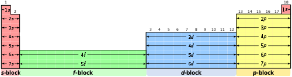
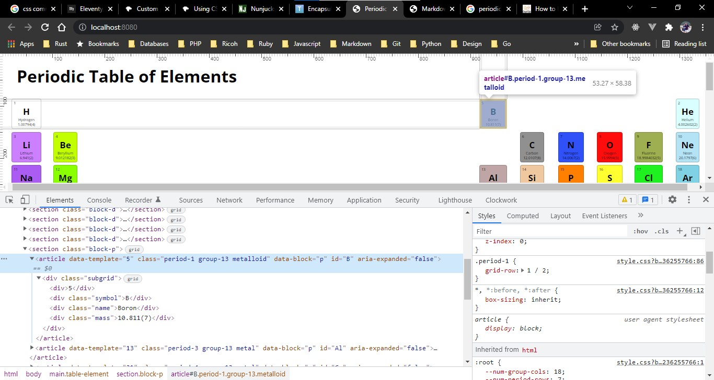
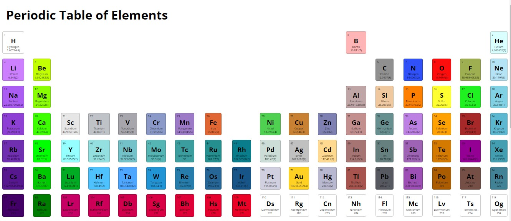
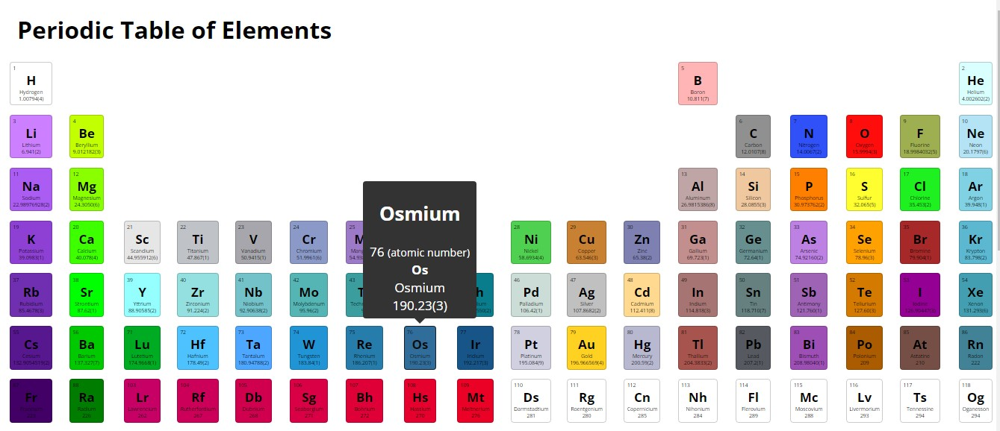

# Periodic Table of Elements
This project was inspired by a Twitter post. Not from another developer or designer, but an artist friend of mine that was showing off some new enamel pin designs that she was thinking of selling. I don't don't know why, but I immediately wondered if I could make a Periodic Table using only CSS Grid.

## Technologies Used
- [Nunjucks](https://mozilla.github.io/nunjucks/ "Link to Nunjucks Project") - I would need a templating language, due to the nature of the project. I was familiar with Nunjucks, so it only made sense to use it.
- [CSS Grid](https://developer.mozilla.org/en-US/docs/Web/CSS/CSS_Grid_Layout "MDN Link") - The whole purpose of the project. Grid is very powerful and is even more powerful when combined with [Flexbox](https://developer.mozilla.org/en-US/docs/Learn/CSS/CSS_layout/Flexbox "MDN Link"). None the less, this project was about learning Grid and not Flexbox.
- [CSS Custom Properties](https://developer.mozilla.org/en-US/docs/Web/CSS/Using_CSS_custom_properties "MDN Link") - Due to the repetitive nature of this project, one of the challenges was going to be dynamically applying properties to elements. Alignment and background colors specifically. Using Custom Properties made this very simple, I really was not able to leverage them very well and it ended up costing me. More on that later.
- [TippyJS](https://atomiks.github.io/tippyjs/ "TippyJS Link") - The Periodic Table is actually quit large, so I found out. And one of the first issues I had, after the layout was solved, was actually viewing the individual elements. I decided to use this library because it allowed me to quickly create the hover interactions with each element on the table. I mean, I guess I could've created my own solution to this, but since the project was to be centered around getting more familiar with CSS Grid and not creating custom hover effects, I chose this route.
- [11ty](https://www.11ty.dev/ "Eleventy Link") - 11ty is hands down the simplest solution to build this project. Yes! There are a thousand million Javascript frameworks out there that I could've used, but I wanted simple. And 11ty is just simple. It gives me a build process for Nunjucks as well as a hot reloading local server to run the project. Not to mention a really easy way to import the Periodic Table data into the project without overloading the load times of the page. I could've leveraged 11ty's config system a bit more with the CSS, such as combining and compressing the output, but...
- Vanilla Javascript - There are two or three JS files that I created to perform separate tasks, which will be covered later. None of them are built into the project, so there are never loaded on the page. They are utilities and have no effect on the project running locally.

## The Data
I had to find a way to actually get all the data that makes up the Periodic Table. I first thought of using an API, but that would either slow down the build process or page load quit a bit. So I found a really nice JSON representation of the table, which can be found in `_data/periodic-table.json`. Also within that `_data` directory is `pte.js` that I use to feed the JSON content into Nunjucks. I do that by setting a variable called `elements` to the output of `pte.js`, which is just an array that contains the JSON found in `periodic-table.json`.

_Ex 1_
```html
<main class="table-element">
    
    ...
</main>
```

I can then loop over each of the elements returned by `pte`.

_Ex 2_
```html
<section class="block-{{ block }}">
         
            <article 
            data-template="{{ element.atomicNumber }}"
            class="period-{{ element.period }} group-{{ element.group }} {{ element.groupBlock | replace(" ", "-") }}" 
            data-block="{{ block }}"
            id="{{ element.symbol }}">
                <div class="subgrid">
                    <div>{{ element.atomicNumber }}</div>
                    <div class="symbol">{{ element.symbol }}</div>
                    <div class="name">{{ element.name }}</div>
                    <div class="mass">{{ element.atomicMass }}</div>
                </div>
            </article>
    
</section>
```

## Organizing the Layout

The Periodic Table is organized in a special way. Of course just looping through the elements and placing them on the page is like _code vomit_, so I started actually learning how the table is organized into `groups` _(vertical columns)_, `periods` _(horizontal rows)_, and `families` _(groups of elements that are similar)_. This is represented in the data by the `group`, `period` and `groupBlock` properties.

_Fig 1_



To organize the data, within the layout, I leveraged the built-in Nunjucks filter [groupBy()](https://mozilla.github.io/nunjucks/templating.html#groupby "Nunjucks documentation link") by wrapping the above code html in the following:

_Ex 3_
```html

    
        ...
    

```
You might notice that in _Ex 2_ the first element is a `section` element with a dynamic class assignment `class="block-{{ block }}"`. Now it's clear where that came from. I then assign an `article` element with a class of `group-{{ element.group }}`. At this point, the data being displayed on the page is placed in a way that I can use Grid to place the `article` elements to the correct position on the layout more easily.

```css
/* Custom Properties */
:root {
    --num-group-cols: 18;
    --num-period-rows: 7;
    --font-size: .5vw;
    --font-family: 'Open Sans', Arial, Helvetica, sans-serif;
}

/* Set-up the groups/columns of the table */
.table-element {
    padding: 0 1em;
    width: 100vw;
    display:grid;
    grid-template-columns: repeat(var(--num-group-cols), minmax(max-content, 1fr));
    grid-auto-flow: row;
    gap: 2vh;
}

/* Set-up the periods/rows of the table */
section[class*="block-"] {
    display: grid;
    grid-template-rows: repeat(var(--num-period-rows), minmax(max-content, 1fr));
    justify-content: center;
    gap: 2vh;
}

/* To properly place the rows */
.period-1 {
    grid-row: 1 / 2;
}

.period-2 {
    grid-row: 2 / 3;
}

.period-3 {
    grid-row: 3 / 4;
}

.period-4 {
    grid-row: 4 / 5;
}

.period-5 {
    grid-row: 5 / 6;
}

.period-6 {
    grid-row: 6 / 7;
}

.period-7 {
    grid-row: 7 / 8;
}
```

For example, you can see in the example snip-it below, that the inspected element is in `block-p`, `period-1`, `group-13`. Which based on the Grid I outlined above, places it exactly where it is on the page. Pretty neat!

_Fig 2_


## Element Colors
There is no general rule or guide line here. I know that each of the element families where represented by a color, but I didn't know that colors where optional. I mean, I should have, but... I digress. You can create a host of different table types, just by associating a color with a given property. Luckily, our JSON data has the color already assigned. Ya! Less descensions to make! But, there was one problem I wanted to solve. There are a lot of colors here and it would take awhile to create a hand typed list. Javascript to the rescue.

If you take a look at `./assets/js/genColorVars.js`, you will find a Nodejs script that reads the JSON data file and writes `./assets/css/vars.css`. This file is basically a big list of CSS Custom Properties that can be used to assign a background color to a given element. Each element is assigned an id using that elements symbol.

```html
{-- assigning the symbol id to an element --}
<article id="{{ element.symbol }}">
    ...
</article>

{-- outputs to following --}
<article id="B">
    ...
</article>
```

```css
:root {
    --B: #FFB5B5;
}

#B {
    background-color: var(--B);
}
```

This is a bit overkill really and I could've saved a few hundred lines by just assigning the hex code. So I will admit that I over did it here.

## Result
_Fig 3_


_Fig 4_


## What Did I Learn
- __Better Asset Strategy__ - There is currently 6 HTTP Requests, for assets, and that could be dropped to 4 if I combine all three CSS files into one. Since this was an exercise of a certain topic, this is not a big deal. I can see how this would get out of hand very quickly at scale. Using this as a baseline and building on top of it would not end up very performant for anyone. Locally, the project is sitting at around 0.6 secs for First Contentful Paint, Time to Interactive is 1 sec and Total Blocking Time is 250 ms. This is with BrowserSync running. On a server, these numbers might be a tiny bit better, but I still stand by few HTTP Request are better here. Not always, but in this project.
- __Better Accessibility__ - Currently, I feel the hover object is not as assessible as it could be. That is due in part to me not being familiar with TippyJS as a project and not taking a decent enough amount of time to read the docs fully. Using [NVDA Screen Reader]("https://www.nvaccess.org/download/") I got "Meh!" results. Everything was read, but there was a few things that could be better and more time should be spent on. None of this would hurt page performance in anyway and only add usefulness to the project.
- __Custom Properties__ - When used correctly, these can be very helpful. When used incorrectly, I can see how they could add a ton of bloat to your CSS. Be mindful when using them and don't make the same mistake I did! If there is a repeated value used throughout a project, just like a variable in your backend code, assign it to a Custom Property and move on. If not, then don't. I could save roughly 2~3 kb not using them in the color assignments.
- __Grid Area__ - [CSS Grid Areas]("https://developer.mozilla.org/en-US/docs/Web/CSS/grid-area") are supper powerful, once you get your head wrapped around the concept. And once you do, the possibilities are endless. But be mindful! Like most power tools, when used incorrectly, you can get yourself into some sticky situations. General rule though - Try not to vary to far from your original HTML layout. Just because a screen is mobile does not mean that you should move a div from your main area to the footer. Does that make sense?

Between the number of HTTP Requests and CSS bloat, I imagine I could shave roughly half off my downloaded assets. And I don't care if it's a candy bar or mattress, if you see that it's on sale for 50% off, you think it's a good deal right! 